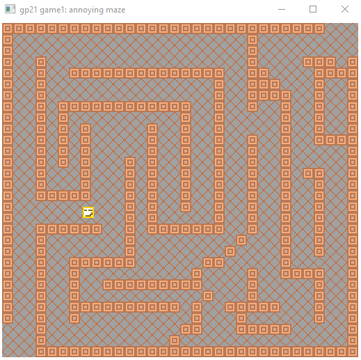

# An Annoying Maze

Author: Weisheng Li

Design: It's just about finding a path in a maze, but the control is not always what you would expect...

Screen Shot:

How Your Asset Pipeline Works:

I author the pixel images through an online drawing tool called Pixelart. The image is exported as png files. I use a python script png2tiles.py to convert all 8*8 png images to a single runtime file, tiles.asset. It then gets loaded into the PPU in the constructor of PlayMode.

The background is hard coded. My original plan was to segment the background and read it in as regular tile assets, but don't have time to finish that.

How To Play:

Control: ↑ ↓ → ←
Goal: find your way to the upper right corner of the map, which is the exit of maze

This game was built with [NEST](NEST.md).

